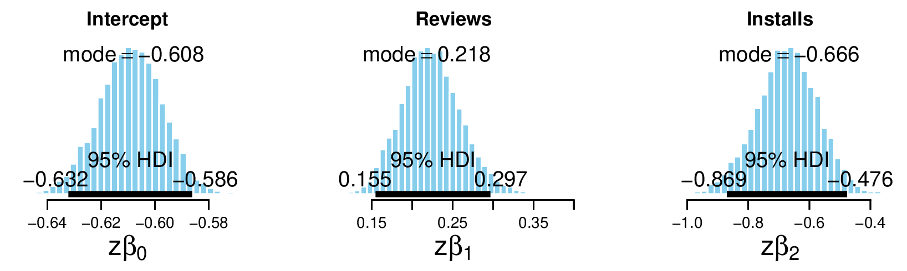

```{r setup, include=FALSE}
knitr::opts_chunk$set(echo = FALSE, cache = TRUE, autodep = TRUE)
library(ggplot2)
library(plyr)
library(corrplot)
source("modelling.R")
```

# Introduction

Multiple factors affect how a smartphone app is perceived by the user community, from the price tag to which category the app falls in. Different categories of apps can have different demographics of users and different rating and reviewing habits. If a developer team wants to build an app analysing the currently available apps can help in determining where they can find the most success.

Our goal is to find the relationships between the rating of an app and its number of installs, the app's price tag and the number of reviews. These are rather indirect variables that could be correleted to the rating of the application. We are interested in finding out how important these features are for predicting the rating and whether we can find any significant difference in the importance of the features.

We have used Generalized Logistic Regression as our model for the rating. The rating is divided into three categories - High, Medimum and Low - which correspond to rating values of (r >= 4.5), (4.5> r >= 3.5) and (3.5 > r) respectively. The categorisation is not uniform over the range of the ratings, but from our own experience, people don't perceive the ratings uniformly either. We perform one vs all logistic regression for all of these categories. Then we try to interpret the parameters.

Note: The dataset has more features, we had originally planned to use them in our analysis. But we had to limit our scope to fewer variables due to time and computational constraints.

# Data

The data has been obtained from [Kaggle](https://www.kaggle.com/gauthamp10/google-playstore-apps). It contains two files, one with 250,000 apps' data and one with 32,000 apps' data. We are limiting this project to the 32 k samples file due to time and computation constraints.

# EDA and Preprocessing

The number of installs and price of the app are given as strings that cannot be directly converted into numbers. So we wrote functions to process and properly convert them into numerical data. The number of installs are still not strictly numerical, since the data we received had categories like "100+", "10,000+" them. We had to remove the dollar symbol for converting the price. Then we converted the ratings into categories as mentioned in the introduction.

| High     | Medium         | Low     |
|:--------:|:--------------:|:-------:|
| r >= 4.5 | 4.5 > r >= 3.5 | 3.5 > r |

Finally we dropped the extra features.

```{r load_data}
mydata <- load_data("data/Google-Playstore-32K.csv")
mydata["Rating"] <- 3 * mydata["Rating_high"] + 2 * mydata["Rating_med"] + 1 * mydata["Rating_low"]
mydata["Rating"] <- as.factor(mydata$Rating)
```

## Few observations in the data
```{r eda1}
print(head(mydata))
```

## Summary
```{r eda2}
summary(mydata)
```
The summary shows that there are some extreme values for both Reviews and Installs on both ends. Where as for Price, most of the apps are free or very cheap and a very few have high price tags.

## Distribution of Rating
```{r rating_bar}
plt <- ggplot(mydata)
plt + geom_bar(aes(Rating), fill="#0066ff")
```

## Distibutions of features

NOTE: For all distribution plots, the Y axis is logarithmically scaled.

As the summary suggested, there are some very extreme values for all features.

### Reviews
```{r reviews_box}
plt <- ggplot(mydata)
plt + geom_boxplot(aes(x=Rating, y=Reviews), color="#0066ff") + scale_y_continuous(trans = "log10")
```

Low rated apps tend to have fewer reviews than Medium and High rated apps.

### Installs
```{r installs_box, warning=FALSE}
plt <- ggplot(mydata)
plt + geom_boxplot(aes(x=Rating, y=Installs), color="#0066ff") + scale_y_continuous(trans = "log10")
```

Same is true for number of installs, which aligns with our intuition.

### Price
```{r price_box, warning=FALSE}
plt <- ggplot(mydata)
plt + geom_boxplot(aes(x=Rating, y=Price), color="#0066ff") + scale_y_continuous(trans = "log10")
```

One might expect to find positive correlation between the price and the rating of the app. But these box plots suggest that there is almost no correlation.

### Correlation plot
```{r correlation}
M <- cor(mydata[,c("Reviews", "Installs", "Price")])
print(M)
```

```{r correlation_plot}
col1 <- colorRampPalette(c("#888888", "#880000"))
corrplot(M, method="number", type="upper", col=col1(4))
```

The correlation matrix shows that the price is not correlated with either of the other features, whereas there is a positive correlation between the number of reviews and installs.

# Model

## Specification

We are using a **Generalized Logistic Regression** to model the data. The ratings are modeled as "one vs all." This means that we have three models, one for each rating category. The model tells us how the posterior distribution of a data point belonging to the corresponding category.

The rating is modelled as a Bernoulli variable. The parameter of the Bernoulli distribution is a logitic function of the features. And the parameters of the logistic function have normal distribution priors.

\[
y_{i} \leftarrow \mathrm{Bernoulli}\left(\mu_{i}\right), \mu_{i} \leftarrow \mathrm{logistic}\left(\beta_{0} + \beta_{1} \cdot \mathrm{Reviews} + \beta_{2} \cdot \mathrm{Installs} + \beta_{3} \cdot \mathrm{Price}\right), \beta_{j} \leftarrow N(0, \sigma_{j})
\]

## MCMC

We performed MCMC simulations for every model using JAGS. 15,000 samples were generated for every model and their convergence was verified using two chains. The standard deviation for prior of the $\beta_{0}$ parameters was 0.25 and for the rest of the parameters it was 1.0.

We are presenting the standardized parameter posterior distributions here in order to easily compare them. Additional figures like the posterior distributions of the parameters in normal scale and their correlations can be found in the attachment of this report.

### High
```{r, fig.retina=NULL, out.width=540}

```
```{r, fig.retina=NULL, out.width=160}

```

### Medium
```{r, fig.retina=NULL, out.width=540}

```
```{r, fig.retina=NULL, out.width=170}

```

### Low
```{r, fig.retina=NULL, out.width=540}

```
```{r, fig.retina=NULL, out.width=170}

```

# Results and Conclusion

We saw that the medium rating category had the highest number of samples. The posterior distributions of the intercept reflect the observation. The intercept is positive for the medium rating model and negative for the rest. Which means that, in absence of any reviews, installs and zero price, the app is much more likely to be a medium rated app than a high or low rated.

The reviews parameter is positive for high rating and negative for the others. Which means that the posterior probability increases with number of reviews for being a high rated app and decreases for medium and low rating. In fact, since the parameter values indicate the log odds change in absence of other features, the posterior of being a low rated app decreases much more rapidly.

The installs parameter is positive for medium rating and negative for the others. This has similar meaning to the reviews parameter.

The price parameter is very close to zero than the other parameters for all three models. Which means it has the least impact in determining the rating of the app. For low rating model, zero falls right in the middle of the 95% HDI. Which means price cannot help us distinguish whether an app is low rated or not. Between high and medium rating models, the parameter is positive for high rating and negative for medium rating. Which means an app is slightly more likely to be high rated than medium rated as the price increases.

